# Workflow: Receiver Execution Gap Analysis

```mermaid
graph TD
    Start([Start: Clean Slate]) --> Phase1[Phase 1: Infrastructure]
    
    Phase1 --> Setup[Setup Repo Structure]
    Setup --> LoadData[Load Raw Data]
    LoadData --> Filter[Filter to Contested Catches<br/>2+ defenders, 7118 plays]
    
    Filter --> Phase2[Phase 2: Implement Metrics]
    
    Phase2 --> SQI[Calculate SQI<br/>Separation Quality Index]
    Phase2 --> BAA[Calculate BAA<br/>Ball Arrival Advantage]
    Phase2 --> RES[Calculate RES<br/>Route Efficiency Score]
    Phase2 --> CTI[Calculate CTI<br/>Coverage Tightness - Defense]
    
    SQI --> BatchCalc[Batch Calculate<br/>All 7118 Plays]
    BAA --> BatchCalc
    RES --> BatchCalc
    CTI --> BatchCalc
    
    BatchCalc --> Phase3{Phase 3: VALIDATION<br/>Critical Checkpoint}
    
    Phase3 --> Correlate[Correlation Analysis<br/>Metrics vs Completion]
    Correlate --> CheckCorr{r > 0.3?<br/>p < 0.05?}
    
    CheckCorr -->|YES| BoxPlots[Visual Validation<br/>Box Plots]
    CheckCorr -->|NO| Pivot1[Pivot: Adjust Metrics<br/>or Redefine Gap]
    Pivot1 --> Correlate
    
    BoxPlots --> CoverageAdj[Coverage-Adjusted<br/>Validation]
    CoverageAdj --> CheckCoverage{Holds within<br/>coverage type?}
    
    CheckCoverage -->|YES| Phase4[Phase 4: Baseline Model]
    CheckCoverage -->|NO| Pivot2[Pivot: Coverage-Adjusted<br/>Framework]
    Pivot2 --> Phase4
    
    Phase4 --> TrainModel[Train Logistic Regression<br/>completion ~ SQI + BAA + RES]
    TrainModel --> PredictExp[Predict Expected<br/>Catch Rate]
    PredictExp --> CalcGap[Calculate Execution Gap<br/>actual - expected]
    CalcGap --> CheckAcc{Accuracy<br/>> 65%?}
    
    CheckAcc -->|YES| Phase5[Phase 5: Player Analysis]
    CheckAcc -->|NO| Pivot3[Pivot: Simplify to<br/>Quality Rankings]
    Pivot3 --> Phase5
    
    Phase5 --> Aggregate[Aggregate by Receiver<br/>min 20 targets]
    Aggregate --> RankPlayers[Rank by Execution Gap]
    RankPlayers --> Identify[Identify Archetypes<br/>Elite/Clutch/System/Struggling]
    Identify --> CoveragePress[Analyze vs Coverage Pressure]
    
    CoveragePress --> Phase6[Phase 6: Visualizations]
    
    Phase6 --> HeroViz[Hero Viz: Elite vs System<br/>Scatter Plot]
    Phase6 --> ValidViz[Validation: Box Plots]
    Phase6 --> RankViz[Top 10 Gap Leaders<br/>Bar Chart]
    Phase6 --> PressViz[Gap vs Coverage Tightness]
    
    HeroViz --> Phase7[Phase 7: Technical Notebook]
    ValidViz --> Phase7
    RankViz --> Phase7
    PressViz --> Phase7
    
    Phase7 --> NotebookIntro[Intro & Problem]
    NotebookIntro --> NotebookMetrics[Metrics Framework]
    NotebookMetrics --> NotebookValid[Validation Results]
    NotebookValid --> NotebookModel[Baseline Model]
    NotebookModel --> NotebookRank[Player Rankings]
    NotebookRank --> NotebookInsights[Key Findings]
    NotebookInsights --> NotebookTest{Runs End-to-End<br/>Without Errors?}
    
    NotebookTest -->|NO| FixNotebook[Debug & Fix]
    FixNotebook --> NotebookTest
    NotebookTest -->|YES| Phase8[Phase 8: Kaggle Writeup]
    
    Phase8 --> WriteHook[Opening Hook<br/>Super Bowl Examples]
    WriteHook --> WriteProblem[Problem Statement]
    WriteProblem --> WriteSolution[Solution: Metrics + Gap]
    WriteSolution --> WriteValid[Validation Summary]
    WriteValid --> WriteFindings[Key Findings]
    WriteFindings --> WriteApps[Coaching Applications]
    WriteApps --> WriteLimits[Limitations]
    WriteLimits --> CheckWords{Exactly<br/>2000 words?}
    
    CheckWords -->|NO| EditWriteup[Cut or Expand]
    EditWriteup --> CheckWords
    CheckWords -->|YES| PeerReview[Peer Review]
    
    PeerReview --> Phase9[Phase 9: Submission Prep]
    
    Phase9 --> README[Write GitHub README]
    README --> CleanRepo[Clean Repository]
    CleanRepo --> TestFinal[Final Integration Test]
    TestFinal --> Upload[Upload to Kaggle]
    Upload --> AttachNotebook[Attach Notebook]
    AttachNotebook --> LinkGitHub[Link GitHub Repo]
    LinkGitHub --> SelectTrack[Select Track: University]
    SelectTrack --> Preview[Preview Submission]
    Preview --> CheckDeadline{Before Dec 17<br/>Deadline?}
    
    CheckDeadline -->|NO| Panic[Emergency Submit]
    Panic --> Submit
    CheckDeadline -->|YES| Submit[Submit Competition Entry]
    
    Submit --> Done([Submission Complete])
    
    style Phase3 fill:#ff9999
    style CheckCorr fill:#ffcc99
    style CheckCoverage fill:#ffcc99
    style CheckAcc fill:#ffcc99
    style HeroViz fill:#99ff99
    style Done fill:#99ff99
    style Pivot1 fill:#ffcccc
    style Pivot2 fill:#ffcccc
    style Pivot3 fill:#ffcccc
```

## Legend

- 🔴 **Red nodes:** Critical validation checkpoints (must pass)
- 🟠 **Orange nodes:** Decision points (may require pivot)
- 🔄 **Pink nodes:** Pivot paths (adjust if validation fails)
- 🟢 **Green nodes:** Success milestones
- ⬜ **Gray nodes:** Standard workflow steps

## Critical Path

1. **Infrastructure → Metrics → VALIDATION** ← Most critical
2. **Baseline Model → Player Analysis** ← Core insight generation
3. **Visualizations → Notebook → Writeup** ← Storytelling
4. **Submission** ← Deadline-driven

## Parallel Work Opportunities

- Metrics (SQI/BAA/RES/CTI) can be implemented in parallel
- Visualizations can be drafted before final data is ready
- Writeup drafting can start during notebook development
